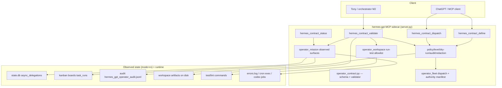

# Hermes GPT v0.6 — Outcome / Work Contracts: Technical Design (M1)

- Status: DRAFT for review (G3 packet)
- Date: 2026-08-13
- Owner: hermes-dev
- Gate: **G3** (release plan `docs/releases/v0.6-plan.md` §4.2/§7) — M1 design +
  legal/risk sign-off, **before M1 implementation is dispatched**. This card is
  design-only; no implementation is dispatched by this artifact.
- Inputs:
  - `docs/releases/v0.6-brief.md` §2.2 / §5 / §6 (approved 2026-08-12, `19cd01a`)
  - `docs/design/v0.6-mission-control.md` (M0 technical design, `8c6462b`)
  - `operator_mission.py` (M0 implementation, `8e1f31a` on `feat/m0-mission-control`)
  - `operator_fleet.py`, `operator_policy.py`, `operator_workspace.py`,
    `operator_diagnostics.py`, `operator_cron.py`, `operator_codex.py`
    (existing primitives to reuse)
  - `docs/releases/v0.6-data-risk-review.md` (legal; P1-1 "approvals stay
    view-only", P0-1..P0-3, cross-cutting controls)
  - `docs/releases/v0.6-mission-control-surface-manifest.md` (G2 packet)
- Consumers: implementation engineer (M1), `default` (integration/verify),
  `legal` (G3 risk sign-off), M2 design (swarm orchestrator builds on
  contracts).
- **This document is a design only. No implementation.**
- Related planning artifact: `docs/releases/v0.6-plan.md` §4.2.

---

## 1. Purpose

This document is the technical design for **Outcome / Work Contracts** (v0.6
capability 2): structured work orders whose *objective, assigned agent/profile,
allowed scope, forbidden actions, expected artifacts, tests, review
requirements, and completion criteria* are declared up front, and where
**completion is verified against observed Mission Control state** (run /
outcome / artifacts) rather than a worker's claim.

It is the design task referenced in the plan (`v0.6-plan.md` §4.2) and
consumed by the risk review (legal, for G3) and Swarm Orchestration (M2, which
runs workflows on top of contracts). It **does not** cover Swarm Orchestration
(capability 3, own design) or Mission Control's read-only view (M0, already
designed and implemented on `feat/m0-mission-control`); Work Contracts is the
**verification** layer that Mission Control's observed state makes possible.

**Acceptance (from the card):** a fresh engineer can estimate and implement
the contract schema, the validator, and the dispatch/validate loop from this
design without re-interviewing the requester; and the design demonstrates how
the validator **rejects a false "done" claim** (M1 exit criterion / success
criterion S2).

---

## 2. Design goals and non-goals

### Goals

- **G-WC1.** Define a **contract schema** (`hermes.work-contract/v1`) carrying
  the brief §2.2 fields: objective, assigned agent/profile, allowed scope,
  forbidden actions, expected artifacts, tests, review requirements,
  completion criteria — plus the envelope/identity/authorization metadata
  needed to dispatch and validate.
- **G-WC2.** Define a **validator** that determines whether work *actually
  satisfied the contract* against **observed** Mission Control state — run
  status/outcome, artifacts on disk, tests, review, audit — **never the
  worker's self-report** (S2, risk R4). It must reject a false "done" claim.
- **G-WC3.** Define a **dispatch/validate loop** that is **dry-run-first and
  gated** (S4): dispatch reuses the existing fleet work-order + authority +
  policy + audit primitives; validation reuses Mission Control's read-only
  surfaces and the workspace run-test allowlist.
- **G-WC4.** **Reuse, don't reinvent** (brief constraint): authority manifest,
  operator policy, dry-run/apply model, audit log, fleet work-order envelope,
  and safety primitives are the foundation. M1 adds a contract layer and a
  validator; it does not build a parallel authority/audit/policy system.
- **G-WC5.** Contracts must be **auditable and redacted** consistent with M0:
  no raw prompt bodies cross the surface; contract objectives are
  `prompt_len`+`prompt_sha256` in surfaces; validation evidence is
  summary-based.
- **G-WC6.** Provide a **deterministic, reproducible verdict** that a human
  (Tony) or a downstream orchestrator (M2) can consume: `SATISFIED`,
  `NOT_SATISFIED`, `INCONCLUSIVE`, `INVALID_CONTRACT`, with per-check detail.

### Non-goals

- **NG-WC1.** No weakening of Operator/Owner gates (brief NG1). Dispatch of a
  contract still requires the existing operator levels, dry-run-first, and
  explicit confirmation. Approval stays view-only from Mission Control (P1-1).
- **NG-WC2.** No new persistent store owned by this design. A contract is a
  **declarative JSON document**; it may live wherever the dispatcher keeps work
  orders (fleet work-order envelope, kanban task body, or a contracts dir),
  but the validator reads observed state from existing Mission Control sources
  (`state.db`, kanban `task_runs`, audit, workspace) — not a new schema.
- **NG-WC3.** Not a general CI/CD runner. The validator runs only the contract's
  declared **test/lint commands through the existing workspace allowlist**; it
  does not execute arbitrary shells (hard `shell=False` rule).
- **NG-WC4.** Not a policy-enforcement sandbox. Forbidden-actions are **detected
  and flagged** from observed state (audit + artifact inspection), not
  prevented at runtime — prevention stays with the existing operator policy.
  This matches brief NG2 (no fake sandbox claims).
- **NG-WC5.** No M2 swarm engine. This design defines the contract and validator
  M2 consumes; the workflow engine is separate.
- **NG-WC6.** No implementation during this planning phase (brief NG6).

---

## 3. Context: what exists today (reuse surface)

M1 layers on the operator primitives and the M0 Mission Control view.

### 3.1 The contract verification source: Mission Control (M0, on this branch)

`operator_mission.py` exposes the observed state the validator reads
(`mode=ro`, redacted, audited):

| Surface | Observed state the validator can read | Redaction rule |
|---|---|---|
| `hermes_mission_delegations` | `async_delegations` (id, state, timestamps, scope) + `kanban_runs` (task_id, board, assignee, status, outcome, error capped) | never `task_json`/`result_json`/kanban body/metadata |
| `hermes_mission_failures` | recent errors by source (kanban run errors, cron failures) | truncated + redacted |
| `hermes_mission_approvals` | pending approvals (kind, source, id, status, `prompt_sha256`) | never raw bodies |
| `hermes_mission_audit` | recent audit records (tool, level, apply_mode, dry_run, changed, success, error, summary) | summary-based |
| `hermes_mission_codex` | operator Codex jobs (id, state, timestamps, model, return_code) | never transcripts |
| `hermes_mission_overview` | composed bounded doc + `surfaces_unavailable` | low/med only |

**Key contract: `kanban_runs[].{task_id, board, assignee, status, outcome,
error, started_at, ended_at}` and `async_delegations[].{delegation_id, state,
dispatched_at, completed_at}` are the **observed run/outcome record** the
validator uses to confirm a dispatched contract actually reached a terminal
state — not the worker's word.

### 3.2 The dispatch/authority surface: fleet work-order

`operator_fleet.hermes_fleet_dispatch_work_order(...)` already implements the
safe dispatch primitive M1 reuses:

- Envelope `hermes.fleet.work-order/v1`: agent, task_id, target_profile,
  objective, workspace, inputs, constraints, acceptance_checks, deliverables,
  authorization.
- **Authority manifest** (`_load_authority`) → per-peer `allowed_profiles`,
  `max_authorization`, `allow_public_actions`; `_authorize_order` enforces
  profile ceiling + auth class rank + secret/vault/public-action refusals.
- **Live peer verification** (`_verify_live_peer`): identity + host-role match
  before dispatch.
- **Dry-run-first + confirm gate**: `dry_run=True` default → plan;
  `confirm=True` + direct mode → real dispatch.
- Audit on every step.

### 3.3 Policy / dry-run / audit / safety: `operator_policy` and `operator_workspace`

- `OperatorPolicy` (`require_level`, `require_mutation`, `require_owner`,
  `effective_dry_run`, `allowed_profiles`, `allowed_paths`, `is_denied_path`).
- `audit_record` (prompt→`{prompt_len, prompt_sha256}`, path→basename+len,
  bounded) and `audit_tail`.
- Redaction: `redact_output`, `_sanitize_exception_message`.
- `hermes_workspace_run_test` — **conservative command allowlist**
  (pytest / python -m pytest / npm test / ruff / mypy / git status|diff),
  `shell=False`, bounded timeout, workdir under allowed paths, dry-run+audit.
  This is the **only test executor** M1 uses.

---

## 4. Design overview

### 4.1 Shape of the surface

Work Contracts is delivered as a **new module** `operator_contract.py`
(consistent with `operator_*` conventions) exposing a small tool group
(namespace `hermes_contract_*`):

| Tool | Kind | Level | Returns |
|---|---|---|---|
| `hermes_contract_define` | read-only, pure | `read_only` | Canonical contract doc (`hermes.work-contract/v1`) + `contract_sha256`; validates schema |
| `hermes_contract_dispatch` | mutation, dry-run-first | `workspace` | Submits a contract as a fleet work order; dry-run plan by default; confirm + direct to dispatch |
| `hermes_contract_validate` | read-only (may run allowlisted tests) | `read_only` (tests require `workspace` + direct) | Verdict against **observed** state |
| `hermes_contract_status` | read-only | `read_only` | Link a contract to its observed run/delegation state (summary) |

The validator is the S2 heart; dispatch/define reuse existing machinery. All
four audited, all bounded, all redacted — no raw contract objective crosses
the surface (`prompt_sha256` only).

### 4.2 Three layers

```
                        ┌──────────────────────────────┐
                        │         Trusted client       │
                        │   (ChatGPT via MCP today;    │
                        │    Tony / orchestrator)      │
                        └──────────────┬───────────────┘
                                       │ hermes_contract_* (MCP)
                                       ▼
┌───────────────────────────────────────────────────────────────┐
│                 hermes-gpt MCP sidecar (server.py)            │
│  operator_contract.py (NEW): contract schema + validator      │
│   ├── dispatch ──► operator_fleet work-order + authority      │
│   ├── validate  ──► observed Mission Control surfaces +       │
│   │                 workspace run-test allowlist              │
│   └── audit / policy / redaction (operator_policy)            │
└───────────────┬───────────────────────────────┬───────────────┘
                │                               │
                ▼                               ▼
   observed run/outcome/artifacts      worker/agent (Hermes profile,
   (Mission Control, mode=ro)          Codex, fleet peer)
```

**The invariant that delivers S2:** the worker's *result* is never treated as
evidence. Evidence is (a) the observed run/outcome record in Mission Control,
(b) artifacts that exist on disk under the allowed workspace, (c) allowlisted
tests that exit 0, (d) review evidence in the audit trail, and (e) absence of
forbidden actions in the audit trail. If the worker *claims* "done" but these
observed facts do not hold, the validator returns `NOT_SATISFIED`.

### 4.3 Design decisions (binding)

| # | Decision |
|---|---|
| D1 | **Namespace `hermes_contract_*`**, module `operator_contract.py`, matching `operator_*`/`hermes_mission_*` conventions (JSON str returns, `_default_hermes_root`, audit every call). |
| D2 | **Contract schema `hermes.work-contract/v1`** (see §6). It **extends** the fleet work-order envelope (reuses agent/task_id/profile/objective/workspace/inputs/constraints/authorization fields) and **adds** structured forbidden-actions, expected-artifacts, tests, review-requirements, completion-criteria. |
| D3 | **Canonical identity = `contract_sha256`** of the canonicalized contract JSON (sort_keys, ensure_ascii=False), plus a human `task_id`. Validation is keyed by `task_id`→observed run. |
| D4 | **Validation evidence is observed-only.** The validator reads Mission Control surfaces and the workspace; it never consumes a worker-supplied `result`/`completion_bundle` as proof. The worker's result may be *shown* to the human as context, but is **not** a satisfaction criterion. |
| D5 | **Forbidden actions are detected, not prevented** (NG-WC4): the validator checks the audit trail (and artifact set) for forbidden-action signals and returns `NOT_SATISFIED` if found; prevention remains the operator policy's job. |
| D6 | **Tests run only through the workspace allowlist** (`hermes_workspace_run_test`), `shell=False`, bounded timeout, workdir under allowed paths. Validation with tests requires `workspace` level + direct apply mode; otherwise test checks are `UNVERIFIED` not `SATISFIED`. |
| D7 | **Verdict is deterministic and fail-closed.** Any required check that cannot be positively verified from observed state yields `NOT_SATISFIED` or `INCONCLUSIVE` — never a pass-by-default. A missing observed run → `INCONCLUSIVE` (cannot confirm), not `SATISFIED`. |
| D8 | **Redaction by class** (consistent with M0): contract objective → `prompt_sha256` on surfaces; forbidden-action list is LOW/MED labels (no raw secret shapes); expected artifacts are basenames only on surfaces; validation evidence is summary-based. |
| D9 | **Every contract call is audited** (tool, level, apply_mode, dry_run, success, changed, summary, contract_sha256, task_id) via `op.audit_record`. |
| D10 | **No new persistent store.** Contracts are documents; the validator reads existing sources. If a durable contract ledger is wanted it uses the existing kanban/fleet stores (NG-WC2). |
| D11 | **Levels:** dispatch = `workspace` (mutation, dry-run-first, confirm). define/validate/status = `read_only` by default; validate's test-execution step is individually gated at `workspace`+direct (D6). |

---

## 5. Architecture

### 5.1 Component diagram (Mermaid)



### 5.2 Module layout

```
operator_contract.py         # NEW: schema + canonicalize + validator + dispatch bridge
test_operator_contract.py    # NEW: tests (fixture-only), incl. false-"done" rejection
server.py                    # register hermes_contract_* tools (one add_tool each)
docs/design/v0.6-work-contracts.md   # THIS DESIGN
```

`operator_contract.py` follows the M0 conventions:
- imports `operator_policy as op`; returns JSON `str` from public wrappers;
- imports `operator_mission as mission` (observed surfaces),
  `operator_fleet as op_fleet` (dispatch/authority),
  `operator_workspace` (test allowlist);
- every public function audits + bounds output.

### 5.3 Existing building blocks reused

| Capability | Reuse |
|---|---|
| Authority manifest + peer authZ | `operator_fleet._load_authority`, `_authorize_order`, `_verify_live_peer`, `AuthorityPeer` |
| Work-order envelope | `operator_fleet._canonical_work_order` fields (agent, task_id, target_profile, objective, workspace, inputs, constraints, authorization) — extended by D2 |
| Dispatch + dry-run + confirm | `operator_fleet.hermes_fleet_dispatch_work_order` (or its canonicalizer + `_authorize_order`), `OperatorPolicy.effective_dry_run` / `require_mutation` |
| Policy / levels / profiles / paths | `OperatorPolicy`, `profile_is_allowed`, `is_denied_path`, `path_under_allowed`, `resolve_profile_home` |
| Audit | `op.audit_record`, `op.audit_tail`, `audit_log_path` |
| Redaction | `op.redact_output`, `_prompt_meta` style (`{prompt_len, prompt_sha256}`), `_sanitize_exception_message` |
| Observed run/outcome state | `operator_mission._kanban_runs_for`, `_async_delegations_for`, `hermes_mission_failures`, `hermes_mission_audit`, `_open_ro` |
| Test executor | `operator_workspace.hermes_workspace_run_test` + `_TEST_COMMAND_ALLOWLIST` + `_DANGEROUS_PATTERNS` |
| Error envelopes | `op.make_error_envelope`, `op.error_from_exception`, `_mission_error` pattern |

Where an existing wrapper already provides a bounded safe read, M1 **calls it**
rather than re-implementing the read — one source of truth.

---

## 6. Contract schema (`hermes.work-contract/v1`)

### 6.1 Envelope

```json
{
  "schema": "hermes.work-contract/v1",
  "task_id": "wc-20260813-001",
  "assigned_agent": "hermes-dev",          // fleet peer / profile name
  "assigned_profile": "hermes-dev",        // operator-level profile, if any
  "objective": "Refactor the mission overview cache…",
  "allowed_scope": { "workspaces": ["/home/user/projects/nexusOS"], "profiles": ["hermes-dev"] },
  "forbidden_actions": [
    {"action": "public_publish", "reason": "no public posts", "class": "HIGH"},
    {"action": "secret_access",   "reason": "no .env/auth read", "class": "HIGH"},
    {"action": "vault_policy_edit","reason": "no vault policy changes", "class": "HIGH"}
  ],
  "expected_artifacts": [
    {"path": "src/nexusos/cache.py", "must_exist": true, "min_bytes": 1},
    {"path": "docs/design/v0.6-work-contracts.md", "must_exist": true}
  ],
  "tests": [
    {"name": "lint", "command": "ruff check src", "workdir": "/home/user/projects/nexusOS"},
    {"name": "unit", "command": "python -m pytest -q tests/", "workdir": "/home/user/projects/nexusOS"}
  ],
  "review_requirements": {
    "required": true,
    "reviewer": "default",                 // must differ from assigned_agent
    "evidence": "audit_tool:hermes_contract_validate/accept OR human approval",
    "approval_required": true
  },
  "completion_criteria": {
    "run_state": {"terminal": true, "outcome_ok": ["completed", "done"]},
    "artifacts_present": true,
    "tests_pass": true,
    "review_satisfied": true,
    "no_forbidden_actions": true,
    "authorization": {"class": "reversible_write", "approved": true, "approved_by": "Tony", "approval_reference": "t_xxx"}
  },
  "inputs": [],
  "constraints": ["bounded output", "no secret paths"],
  "authorization": {"class": "reversible_write", "approved": true, "approved_by": "Tony", "approval_reference": "t_xxx"}
}
```

### 6.2 Field reference (brief §2.2 mapping)

| Brief §2.2 field | Contract field | Notes / reuse |
|---|---|---|
| objective | `objective` | plain bounded text (≤ 8000 B, `_clean_text`); surfaces → `prompt_sha256` |
| assigned agent/profile | `assigned_agent`, `assigned_profile` | reuse fleet `agent` / `target_profile`; must match authority `allowed_profiles` |
| allowed scope | `allowed_scope.workspaces[]`, `.profiles[]` | each workspace must not be a denied path; validation only reads under these |
| forbidden actions | `forbidden_actions[]` | label + reason + severity class; **detected** from audit/artifacts (D5) |
| expected artifacts | `expected_artifacts[]` | basename on surfaces; existence + min_bytes checked on disk under allowed workspaces |
| tests | `tests[]` | only allowlisted commands (D6); each `{name, command, workdir}` |
| review requirements | `review_requirements` | reviewer must differ from assignee; evidence via audit/human approval |
| completion criteria | `completion_criteria` | the machine-checkable gate (D7 fail-closed) |

### 6.3 Canonicalization

`hermes_contract_define` validates and returns a canonical form:
- Every field validated (types, bounds, regexes — reuse `_clean_text`,
  `_string_list`, `_TASK_ID_RE`, `_PROFILE_RE`, `_AGENT_RE` style guards).
- `forbidden_actions` normalized to `{action, class}` (LOW/MED/HIGH);
  HIGH severity entries are **mandatory rejections** — if detected, the verdict
  is `NOT_SATISFIED` regardless of other checks.
- `expected_artifacts` resolved relative to each `allowed_scope.workspace`
  (no `..` escaping — reuse `Path.resolve` + `path_under_allowed`).
- `tests` validated against the workspace allowlist (D6).
- `contract_sha256 = sha256(canonical_json)`; `task_id` must be unique for the
  dispatch.

---

## 7. The validator (S2)

### 7.1 Verdict model (deterministic)

```
{
  "schema_version": "0.6-wc.1",
  "tool": "hermes_contract_validate",
  "surface": "contract_validate",
  "task_id": "wc-20260813-001",
  "contract_sha256": "...",
  "verdict": "SATISFIED | NOT_SATISFIED | INCONCLUSIVE | INVALID_CONTRACT",
  "satisfied": true,
  "checks": [
    {"kind": "run_state",  "status": "PASS|FAIL|UNVERIFIED", "detail": "observed kanban status=done outcome=completed"},
    {"kind": "artifacts",  "status": "PASS|FAIL|UNVERIFIED", "detail": "src/nexusos/cache.py exists 4821B"},
    {"kind": "tests",      "status": "PASS|FAIL|UNVERIFIED", "detail": "ruff check src rc=0"},
    {"kind": "review",     "status": "PASS|FAIL|UNVERIFIED", "detail": "reviewer=default != assignee"},
    {"kind": "forbidden",  "status": "PASS|FAIL|UNVERIFIED", "detail": "no HIGH forbidden actions in audit"},
    {"kind": "authorization", "status": "PASS|FAIL", "detail": "auth class approved by Tony"}
  ],
  "false_done_detected": true,
  "rejected_reasons": ["run_state FAIL: observed run status=running, not terminal"],
  "evidence": { "run": {...observed...}, "artifacts": [...], "audit_count": 3 },
  "generated_at": "...",
  "trace_id": "..."
}
```

### 7.2 Check semantics (each fail-closed)

| Check | Pass requires | Fail conditions (→ NOT_SATISFIED) | UNVERIFIED when |
|---|---|---|---|
| **run_state** | An observed kanban `task_runs`/`async_delegations` row for `task_id` with `status`/`outcome` in the contract's `completion_criteria.run_state.outcome_ok` (e.g. `done`/`completed`) | status is `running`/`in_progress`/`blocked`/`error`/`failed`, or outcome mismatch, or run errored | no observed run row found |
| **artifacts** | every `expected_artifacts[].path` exists on disk under an allowed workspace with `size >= min_bytes` | any artifact missing or empty | workspace unreadable / no allowed workspace |
| **tests** | every `tests[].command` runs via allowlist and exits 0 | any test exits non-zero or is refused | tests requested but level/direct not granted (D6) — cannot positively confirm → `NOT_SATISFIED` if tests required |
| **review** | a review evidence record exists whose `reviewer` ≠ `assigned_agent` (audit `hermes_contract_validate` accept by reviewer, or human approval ref) | reviewer == assignee (self-review) or no evidence | review not required |
| **forbidden** | no forbidden action detected for this contract (audit scan + artifact set) | any HIGH forbidden action detected; or any forbidden action present | audit unreadable |
| **authorization** | the contract's `authorization` metadata present with `approved=true` (and `approved_by` for `high_impact`) | missing / not approved | — |

**Aggregation rule (D7):** `SATISFIED` iff every required check is `PASS`. If
any required check is `FAIL` → `NOT_SATISFIED` with `rejected_reasons`. If any
required check is `UNVERIFIED` → **not** `SATISFIED` (either `NOT_SATISFIED` if
a required check can't be confirmed, or `INCONCLUSIVE` if the *observed state
itself* is absent and the contract is valid — design choice below). Optional
checks (e.g. tests when `completion_criteria.tests_pass=false`) do not gate.

### 7.3 INCONCLUSIVE vs NOT_SATISFIED

- `INCONCLUSIVE`: the contract is valid and no check *failed*, but **no observed
  run/outcome exists at all** for `task_id` (e.g. never dispatched, or the run
  is not yet visible). Fail-closed: a human/orchestrator must not treat an
  unconformed contract as done.
- `NOT_SATISFIED`: at least one check **positively failed** (observed run not
  terminal/successful, artifact missing, test failed, self-review, or forbidden
  action). This is the **false-"done" rejection**.

### 7.4 The false-"done" rejection (M1 exit criterion, demonstrated)

The validator must reject a worker that **claims** completion without satisfying
the contract. Concrete demonstrable cases (these become tests in
`test_operator_contract.py`):

1. **Claimed done, but run never reached terminal success.** Worker returns
   "done" / submits a `completion_bundle`; observed kanban `task_runs` for
   `task_id` has `status="running"` (or `outcome="error"`). → `run_state FAIL`
   → `NOT_SATISFIED`, `false_done_detected:true`.
2. **Claimed done, but expected artifact missing.** Worker says done; observed
   run is terminal/ok, but `expected_artifacts[0].path` does not exist on disk.
   → `artifacts FAIL` → `NOT_SATISFIED`.
3. **Claimed done, but tests fail.** Observed run ok + artifacts present, but
   the declared `python -m pytest` exits non-zero (or the test is refused by
   the allowlist). → `tests FAIL` → `NOT_SATISFIED`.
4. **Self-review.** The review evidence `reviewer == assigned_agent` (worker
   reviewed its own work). → `review FAIL` → `NOT_SATISFIED`.
5. **Forbidden action taken.** Audit trail shows the assignee performed a
   HIGH-class forbidden action (e.g. touched a denied path / published) during
   the contract window. → `forbidden FAIL` → `NOT_SATISFIED`.
6. **Never dispatched / no observed run.** No kanban/delegation row for
   `task_id`. → `INCONCLUSIVE` (fail-closed).

Every rejection path returns a `rejected_reasons[]` the human can read and a
`false_done_detected:true` flag the orchestrator can branch on.

### 7.5 Evidence provenance

`evidence.run` is populated from Mission Control's observed surfaces
(`_kanban_runs_for`, `_async_delegations_for`, `hermes_mission_failures`,
`hermes_mission_audit`) — **mode=ro**, redacted, bounded. `evidence.artifacts`
is the on-disk stat of expected artifacts (basename + size, no content).
`evidence.audit_count` is the number of audit records considered. The worker's
own `result`/`completion_bundle` is **never** part of evidence.

---

## 8. The dispatch/validate loop

```
Tony / orchestrator
   │  hermes_contract_define (objective, scope, forbids, artifacts, tests, review, criteria)
   ▼
canonical contract (hermes.work-contract/v1, contract_sha256)
   │  hermes_contract_dispatch  (dry_run=True → plan; confirm + direct → dispatch)
   ▼
fleet work-order via operator_fleet (+ authority manifest + live peer verify)
   ▼
worker runs; observed state lands in state.db / kanban task_runs / audit
   ▼
hermes_contract_validate  (reads OBSERVED state only)
   │
   ├─ SATISFIED        → record accepted (audit), release next step / notify
   ├─ NOT_SATISFIED    → return to rework: rejected_reasons[] to worker/human
   ├─ INCONCLUSIVE     → not done; await observed run or human check
   └─ INVALID_CONTRACT → schema/scope/test errors; correct and re-define
```

Rules (S4 / brief constraints):
- Dispatch is **dry-run-first** (default plan) and requires `confirm=true` +
  direct apply mode to actually dispatch — unchanged from fleet work-order.
- Validation's test step individually requires `workspace` + direct (D6);
  everything else reads `mode=ro`.
- Every step audited (D9). No mutation originates from Mission Control (P1-1);
  dispatch is a pre-existing operator/fleet path, not a new Mission Control
  write.

---

## 9. Security, redaction, and data-handling

Consistent with M0 (§6.3) and the risk review:

| Concern | Handling |
|---|---|
| Contract objective on surfaces | `{prompt_len, prompt_sha256}` only (like M0 prompts). Never raw. |
| Forbidden-action labels | LOW/MED/HIGH class + short reason; strip secret-shaped values via `redact_output`. |
| Expected-artifact paths on surfaces | basename + size, never full content; validation reads stat only (no body read). |
| Tests | only allowlisted commands (`_TEST_COMMAND_ALLOWLIST`), `shell=False`, bounded timeout, workdir under allowed paths, stdout/stderr redacted. |
| Audit evidence | summary-based via `op.audit_record`; `contract_sha256` + `task_id`, no objective text. |
| Workspaces | each must pass `is_denied_path`; validation reads only under `allowed_scope.workspaces`. |
| Denied paths / secrets | `.env`, `auth.json`, `mcp-tokens/`, `.ssh/`, `.aws/`, `vault/`, secret-like names remain denied (operator policy) — validator never reads them. |
| Read-only guarantee | Mission Control reads are `mode=ro`; validator opens no write path; only the allowlisted test executor may run commands (D6). |

---

## 10. Open questions (require Tony / integration decisions)

| # | Question | Default assumed | Impact if changed |
|---|---|---|---|
| Q1 | **Contract authority:** may ChatGPT dispatch contracts autonomously, or only Tony / operator-level profiles with pre-approved templates? (brief §8 Q5) | Dispatch requires operator `workspace` level + confirm + direct; pre-approved templates for `high_impact`. ChatGPT acts as a trusted *drafter*, not an autonomous dispatcher. | If autonomous ChatGPT dispatch wanted → must define an explicit authority policy for contracts; raises G3 legal/risk scope. |
| Q2 | **Where do contracts live durably?** (NG-WC2) | Documents; canonical copy in the fleet work-order envelope + observed run in kanban/state.db. No new store this release. | A dedicated `contracts/` ledger → small addition; still read via existing patterns. |
| Q3 | **INCONCLUSIVE handling:** should a valid contract with no observed run ever return `SATISFIED`? | Never (D7 fail-closed). `INCONCLUSIVE` only. | If Tony wants "trust the worker's word when no run tracked" → contradicts S2; not recommended. |
| Q4 | **Test-execution level:** should `hermes_contract_validate` be allowed to run tests at `read_only`, or require `workspace`+direct as designed (D6)? | Requires `workspace`+direct (tests are command execution). `read_only` validate returns test checks `UNVERIFIED`. | If tests should run at `read_only` → weakens S4; not recommended. |
| Q5 | **Review evidence source:** is an audit `hermes_contract_validate` by a non-assignee enough, or must a human Tony approval be recorded for every contract? | Audit evidence by distinct reviewer, or human approval ref; `review_requirements.approval_required` per-contract. | If Tony must approve every contract → the loop gains a mandatory human gate (aligns NG1). |
| Q6 | **Forbidden-action detection scope:** detect from audit log + artifact set only, or also scan for a contract's `forbidden_actions` patterns in produced files? | Audit + artifact inspection (D5). Content scanning is out of scope (NG-WC4). | Content scanning → scope increase; not recommended for v0.6. |
| Q7 | **Codex integration:** should contracts be able to name a Codex job as the observed run (vs. only kanban/delegations)? | Yes — `run_state` may reference `hermes_mission_codex` operator_jobs when the contract dispatches to Codex. | If not → Codex-dispatched contracts can't be validated; M2 wants it. |

---

## 11. How this slots into the v0.6 release

### 11.1 Milestone M1 (plan §4.2)

Sequencing within M1:

1. **Foundation** — `operator_contract.py` skeleton: schema validation +
   canonicalization (`hermes.work-contract/v1`), `contract_sha256`, envelope
   helpers, audit-on-call, bounded/redacted output. Reuses `operator_policy`.
2. **Define** — `hermes_contract_define`: validate + canonicalize a contract;
   pure, `read_only`.
3. **Dispatch bridge** — `hermes_contract_dispatch`: reuse
   `operator_fleet._canonical_work_order` + `_authorize_order` +
   `_verify_live_peer` + dry-run/confirm. `workspace` level.
4. **Validator** — `hermes_contract_validate`: the six checks (§7.2) against
   observed Mission Control state; verdict + `false_done_detected`.
5. **Status** — `hermes_contract_status`: map contract→observed run summary.
6. **server.py registration** + docs.

### 11.2 Dependencies

- **Requires** M0 (`operator_mission.py`) for observed state; fleet authority
  + policy + workspace allowlist (all exist).
- **Feeds** M2 (Swarm Orchestration): M2's workflow engine runs on contracts
  and uses `hermes_contract_validate` at the acceptance-validation step.

### 11.3 Acceptance mapping (brief §5 / §2.2 / plan §4.2)

| Criterion | Where met |
|---|---|
| S2: dispatched contract independently validated; rejects a worker that claims completion without satisfying artifacts/tests/criteria | §7 validator, observed-only evidence (D4), fail-closed (D7); false-"done" cases §7.4 |
| S4: every mutation path dry-run-first + gated; read-only needs no mutation privileges | D2/D6/D11: dispatch dry-run+confirm+direct; validate read-only (tests gated at workspace+direct) |
| brief §2.2 contract fields | §6 schema (objective, agent/profile, scope, forbidden, artifacts, tests, review, criteria) |
| Reuse authority/policy/dry-run/audit/fleet-work-order/safety primitives | §5.3 reuse table; NG-WC2 no new store |
| NG1 no weakening Operator/Owner gates | dispatch reuses operator levels; approval view-only (P1-1) |
| NG2 no fake sandbox claims | forbidden actions are *detected* not *prevented* (NG-WC4) |
| NG6 no implementation in planning | design-only; G3 gates M1 implementation dispatch |

### 11.4 Test plan outline (`test_operator_contract.py`, fixture-only)

Mirrors M0 test style on a temp `hermes_root` fixture (no production data;
`Path.home` patched):

1. **Schema/canonicalization**: valid contract → canonical doc + stable
   `contract_sha256`; each field validated (bounds, regex, forbidden-action
   classes, artifact path resolution, test-command allowlist).
2. **Invalid contract**: bad workspace (denied path), unauthorized profile,
   non-allowlisted test, high_impact without approval metadata →
   `INVALID_CONTRACT` / `PermissionError`.
3. **SATISFIED happy path**: fixture kanban run `status=done outcome=completed`
   + artifacts on disk + allowlisted test exits 0 + distinct reviewer in audit
   → `SATISFIED`.
4. **False-done rejection (S2, the exit criterion)** — each of §7.4 cases 1–6:
   `NOT_SATISFIED`/`INCONCLUSIVE` + `false_done_detected`, never `SATISFIED`.
   Concretely: a worker `completion_bundle` claiming done is **ignored** while
   the observed run is `running` → rejected.
5. **Observed-only evidence**: monkeypatch so the only "completion" is a
   worker-supplied result with no observed run → `INCONCLUSIVE`, not SATISFIED.
6. **Forbidden action**: audit record shows assignee touched a denied path →
   `forbidden FAIL` → `NOT_SATISFIED`.
7. **Test gating (D6)**: at `read_only`, test checks are `UNVERIFIED` and the
   verdict is not `SATISFIED` if tests are required; at `workspace`+direct the
   allowlisted test runs and gates.
8. **Redaction**: contract objective appears only as `prompt_sha256`; no raw
   objective/forbidden secret shapes/artifact content on any surface.
9. **Read-only guarantee**: validator opens all SQLite `mode=ro`; no source
   file created/mutated by validate (mirror M0 test 4).
10. **Audit**: every `hermes_contract_*` call appends an audit record with
    `contract_sha256` + `task_id`.

**M1 exit criterion (plan §4.2):** test case 4 (and 5) — the validator
demonstrably rejects a false "done" claim — is green and independently
re-verified by `default` from the real surface.

---

## 12. G3 coordination note

G3 (plan §7) = **M1 Work Contracts design + legal/risk sign-off, before M1
implementation dispatch**. This document is the design half of the packet.
The legal/risk half is handed off to the `legal` profile for review against
`docs/releases/v0.6-data-risk-review.md`:

- **P1-1** ("pending-approval surface is view-only in v0.6; no mutation from
  MC") is preserved: contract validation and observation are read-only;
  dispatch is the pre-existing operator/fleet mutation path, not a Mission
  Control write. Confirm no new MC mutation surface is introduced.
- **P0-1..P0-3** (no raw bodies, no secrets, authN/authZ + read-access
  logging): this design inherits M0's redaction/audit; the validator surfaces
  only `prompt_sha256` + basename/size evidence. Legal confirms this is
  consistent.
- **ESCALATE items 1–3** (jurisdiction, OpenAI terms, third-party PII): these
  gate **live ChatGPT data transmission** at G5, not M1 design; flag to legal
  that M1 dispatch (operator-level, no new data exposure to ChatGPT beyond the
  redacted `hermes_contract_*` surfaces) does not independently trigger them.
- **Dispatch authority (Q1)**: legal/risk should sign off on the default —
  ChatGPT is a trusted *drafter*, dispatch requires operator `workspace` +
  confirm + direct, and `high_impact` requires pre-approved templates — before
  M1 implementation is dispatched.

---

## 13. References

- `docs/releases/v0.6-brief.md` (approved) — §2.2 capability, §5 S2/S4, §6 constraints, §8 open questions.
- `docs/design/v0.6-mission-control.md` — M0 design (observed-state surfaces, redaction, authN/authZ, size caps, D1–D12).
- `docs/releases/v0.6-plan.md` — §4.2 M1 scope, §7 G3 gate, §8 R4, §10 dispatch map.
- `docs/releases/v0.6-data-risk-review.md` — P0-1..P0-3, P1-1, cross-cutting controls.
- `docs/releases/v0.6-mission-control-surface-manifest.md` — G2 surface/redaction manifest M1 inherits.
- `operator_fleet.py`, `operator_policy.py`, `operator_workspace.py`, `operator_mission.py` — the existing surface + M0 view-model M1 builds on.
- `docs/operator-mode.md` — operator levels / apply / redaction / audit model reused throughout.
