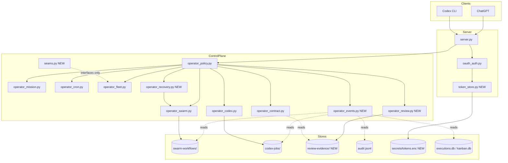
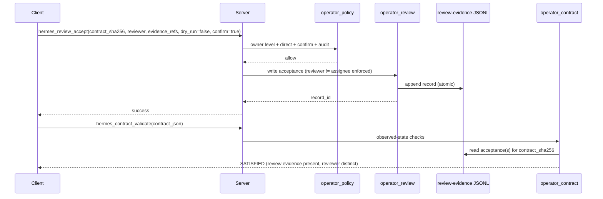
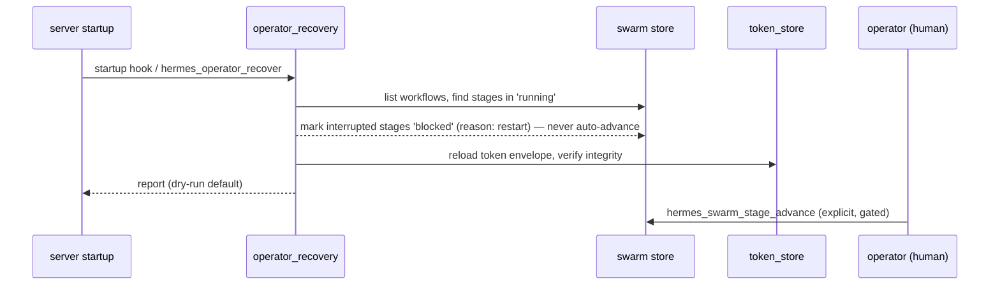

# Hermes GPT v0.7 — Flight Deck: Architecture and Technical Design

- Status: DRAFT for G2 review (kanban t_5a3f6b5c)
- Date: 2026-08-15
- Owner: hermes-dev
- Inputs:
  - `docs/releases/v0.7-flight-deck-research-package.md` (t_78c0d90e, committed `01ff82e`)
  - Live code inspection at master `01ff82e`: `server.py`, `oauth_auth.py`,
    `operator_policy.py`, `operator_mission.py`, `operator_contract.py`,
    `operator_swarm.py`, `operator_swarm_workflows.py`, `operator_codex.py`,
    `operator_cron.py`, `operator_fleet.py`, `operator_diagnostics.py`,
    `operator_skills.py`, `codex_mcp.py`, `pyproject.toml`, `.github/workflows/ci.yml`
- Consumers:
  - `t_164cf992` (legal) — risk and compliance review of this design
  - `t_dd366ab6` (media) — Flight Deck interaction design against the view-model contract (§9.2)
  - `t_d31703e4` (developer) — isolated slice implementation
  - `default` (Tony) — G2 gate approval
- **This document is a design only. No implementation.**
- Companion artifacts: `docs/design/v0.7-flight-deck-adrs.md`,
  `docs/releases/v0.7-flight-deck-risk-register.md`,
  `docs/releases/v0.7-flight-deck-implementation-plan.md`

---

## 1. Purpose

This document is the technical architecture for Hermes GPT **v0.7.0 "Flight
Deck"**: a hardened, continuity-safe control plane from which durable,
long-running, verifiable agent work is watched, steered, reviewed, and trusted
through the existing MCP surface.

It covers all eight release pillars (research package §3), defines component
boundaries, data models, interfaces, state persistence, security boundaries,
test strategy, and migration path, and specifies how implementation is isolated
into independently verifiable slices. Decisions D1–D4 are answered in §12 with
ADR records in the companion ADR document.

**Acceptance (from the card):** architecture document with diagrams, ADRs,
risk register, and implementation plan reviewed by default before proceeding.

---

## 2. Goals and non-goals

### Goals

- **G1 — Current MCP compatibility.** Pin and verify supported MCP protocol
  revisions against the installed SDK; document the minimum supported revision;
  keep the Codex toolset current.
- **G2 — Long-running task lifecycle.** Harden and document lifecycle states
  for cron, Codex jobs, contracts, and swarm stages; add restart reconciliation
  so in-flight state is recoverable after a process restart.
- **G3 — Restart-safe continuity.** Ship durable encrypted token storage
  (decision D1-A) so OAuth credentials survive restarts; document exactly what
  survives and what requires re-authorization.
- **G4 — Production review evidence.** Ship a production review-accept writer
  (decision D3-A) that feeds `hermes_contract_validate`, closing the v0.6 gap.
- **G5 — Structured event history.** Add a unified, queryable, redacted event
  timeline across swarm/contract/kanban/cron/audit (decision D4-A).
- **G6 — Explainable least-privilege authority.** Preserve the level/gate model;
  every new mutation lands in an existing authority class with an explicit gate;
  no parallel bypasses.
- **G7 — Hardened trusted-client access.** Promote the unreleased OAuth boundary
  to shipped, tested, documented; retain loopback/trusted-proxy posture.
- **G8 — Cross-machine swarm seams (stretch).** Define dispatch-adapter,
  remote-evidence-provider, and authority-propagation interfaces only; validate
  with a two-process-one-host fake. No cross-machine implementation.

### Non-goals

- **NG1.** Cross-machine swarm execution (interfaces only, stretch).
- **NG2.** Multi-tenant / multi-owner fleet management (carried from v0.6 NG4).
- **NG3.** Any weakening of Operator/Owner gates to make orchestration easier (NG1).
- **NG4.** No fake sandbox claims (NG2).
- **NG5.** No unauthenticated or public-facing operational data exposure (NG3).
- **NG6.** Flight Deck is not a new authority model; it is a presentation
  contract over the existing MCP surface (decision D2-A; R6 guard).
- **NG7.** No migration of existing stores or tool schemas; v0.7 is additive.

---

## 3. Context: verified current state

Verified against code at master `01ff82e` on 2026-08-15 (details in the
research package; confirmed here by direct inspection).

### 3.1 Architecture today

```
 MCP clients (ChatGPT / Codex)
        │  stdio, streamable HTTP (/mcp), legacy SSE (/sse)
        ▼
 server.py  ── FastMCP sidecar; transport + auth wiring + tool registration
        │
        ├── oauth_auth.py        static bearer / confidential-client OAuth (unreleased on master)
        ├── operator_policy.py   LEVELS ladder, dry-run/direct, Owner ack, audit JSONL, redaction, path safety
        ├── operator_mission.py  12 read-only surfaces (overview/health/profiles/fleet/codex/cron/
        │                        delegations/failures/approvals/vault/usage/audit), allowlist, TTL cache
        ├── operator_contract.py hermes.work-contract/v1, observed-state fail-closed validation,
        │                        review evidence via audit + human approval reference
        ├── operator_swarm.py    hermes.swarm-workflow/v1, DAG stages, caps, human Owner approval,
        │                        durable JSON under <root>/swarm-workflows/
        ├── operator_codex.py    async Codex jobs, durable JSON+JSONL under <root>/codex-jobs/,
        │                        30-day retention, restart reconciliation of orphaned PIDs
        ├── operator_cron.py     per-profile cron registry + executions.db, run timeout 30–7200s
        ├── operator_fleet.py    A2A registry, authority manifest, work-order envelopes
        ├── operator_workspace.py / skills / config / diagnostics / gateway / git / owner tools
        └── codex_mcp.py         curated Codex server (hermes_extract_page vs hermes_web_extract)
```

- The sidecar imports Hermes Agent internals at runtime and never modifies
  Hermes source files.
- Every operator action is audited to an append-only JSONL log; raw prompts and
  secrets are never persisted; Mission Control redacts bodies.
- Default posture is read-only; mutations require direct apply mode plus the
  individual tool's dry-run/confirm gates.

### 3.2 Verified facts relevant to v0.7 (abbreviated; full evidence in research §3)

| Pillar | Verified state |
|---|---|
| MCP | SDK 1.28.1 supports protocols 2024-11-05, 2025-03-26, 2025-06-18, 2025-11-25. Transports stdio/HTTP/SSE. OAuth metadata advertised when configured. |
| Lifecycle | Cron timeout param landed (30–7200s); `run_argv` timeout_cap; self-restarts deferred 3s. Swarm state persisted but stage advance is manual after restart. |
| Continuity | Swarm/codex/audit/sessions/kanban persist on disk. OAuth tokens memory-backed — restart invalidates credentials. |
| Review evidence | Fail-closed validator, **no writer**. Two accepted evidence forms today: distinct-reviewer audit accept, or human approval reference. |
| Event history | Fragmentary: audit JSONL, kanban task_events, cron executions.db, swarm records. No unified timeline. |
| Authority | LEVELS `read_only→cron→skills→skills_config→workspace→owner`; dry-run default; Mission Control allowlist semantics unset=all / list=only / empty=none. |
| Trusted client | OAuth boundary on master (826aa43, Unreleased): PKCE S256, 1h access / 30d rotating refresh, replay rejection, loopback/trusted-proxy enforcement. |
| Cross-machine | Fleet dispatches bounded work to remote A2A peers. Kanban deliberately single-host. Swarm validator reads host-local state only. |
| CI | **RED**: 8 `test_operator_skills.py` failures on master (hermes_constants import in `_call_skill_manager`, commit 5a203f9). Reproduced locally. Blocks all release gates. |

### 3.3 Constraints carried from v0.6 (product invariants, AGENTS.md)

- local loopback is the default network boundary;
- public unauthenticated Operator hosting is unsupported;
- default behavior is read-only; mutating actions opt-in and dry-run-first;
- Owner Mode is break-glass and does not bypass secret-path protections;
- raw prompts are not persisted in Operator audit records;
- Work Contract validation is observed-state and fail-closed;
- Swarm final approval is a human Owner-level gate;
- Codex is never a Swarm implementation owner.

---

## 4. Target architecture overview

```
 MCP clients (ChatGPT / Codex) ── trusted-client boundary (OAuth/bearer)
        │
        ▼
 server.py (transport, auth wiring, tool registration)
        │
        ├────────────────────────────────────────────────────────────┐
        ▼                                                            ▼
 operator_policy.py (LEVELS, gates, audit, redaction)          oauth_auth.py
        │                                                      token_store.py  (NEW: encrypted durable tokens)
        ▼
 ┌────────────────────────────── operator control plane ─────────────────────────────┐
 │ hermes_mission_*   (existing read surfaces)                                        │
 │ hermes_events_*    (NEW read surface — normalized timeline over durable stores)    │
 │ hermes_contract_*  (+ review-evidence store read by validator)                     │
 │ hermes_review_*    (NEW writer: hermes_review_accept → review-evidence JSONL)      │
 │ hermes_swarm_*     (+ restart reconciliation, idempotent advance)                  │
 │ hermes_codex_* / cron / fleet / workspace / skills / config / owner                │
 └────────────────────────────────────────────────────────────────────────────────────┘
        │                                            │
        ▼                                            ▼
 durable stores                         seams (stretch, interfaces only)
 swarm-workflows/  codex-jobs/          DispatchAdapter   (local now / A2A later)
 review-evidence/ (NEW)                 EvidenceProvider  (local now / remote later)
 audit JSONL                            authority propagation (work-order envelope)
 events = read-model over all of the above (no new write path)
```

Key design decisions (full ADRs in `v0.7-flight-deck-adrs.md`):

1. **D1-A — Durable encrypted token storage** ships (new `token_store.py`),
   closing the restart-reauthorize caveat.
2. **D2-A — Flight Deck = control-plane theme; the MCP surface is the UI.**
   A read-only presentation contract (§9.2) is defined for the media lane; any
   dashboard is a thin consumer of existing view models with **no new
   authority**.
3. **D3-A — Owner-gated review-accept writer** (`hermes_review_accept`) with
   distinct-reviewer enforcement in code.
4. **D4-A — New `hermes_events_*` read surface** implemented as a **read-model
   aggregator** over existing durable stores (no parallel write path), with
   allowlist + retention + redaction.

---

## 5. Component boundaries

### 5.1 Existing components (unchanged responsibilities)

| Component | Module | Responsibility |
|---|---|---|
| Transport / registration | `server.py` | FastMCP server, HTTP/stdio/SSE, tool registration, auth wiring, self-restart deferral |
| Auth boundary | `oauth_auth.py` | Static bearer + confidential-client OAuth, PKCE, replay rejection, token lifecycle |
| Policy core | `operator_policy.py` | LEVELS ladder, dry-run/direct, Owner ack, audit JSONL, redaction, path safety |
| Mission Control | `operator_mission.py` | 12 read-only surfaces, allowlist, bounded TTL cache, redaction |
| Contracts | `operator_contract.py` | Work contract define/dispatch/validate/status, observed-state fail-closed validation |
| Swarm | `operator_swarm.py` + `operator_swarm_workflows.py` | DAG workflow engine, stage dispatch/advance, caps, human approval |
| Codex jobs | `operator_codex.py` | Async Codex job lifecycle, persistence, retention, orphan reconciliation |
| Cron | `operator_cron.py` | Per-profile cron registry/run/pause/create/move, timeout caps |
| Fleet | `operator_fleet.py` | A2A registry routing, authority manifest, work-order envelopes |
| Workspace/skills/config/gateway/owner | `operator_workspace.py` etc. | Level-gated mutations, dry-run-first |
| Codex client server | `codex_mcp.py` | Curated MCP server for Codex CLI (distinct tool names) |
| Diagnostics | `operator_diagnostics.py` | doctor/snapshot/recover/release-doctor |

### 5.2 New components

| Component | Module | Responsibility | Authority class |
|---|---|---|---|
| Durable token store | `token_store.py` (NEW) | Encrypted token envelope, key management, rotation, revocation API. Used by `oauth_auth.py`. | Internal (no MCP mutation surface; revocation via owner-gated `hermes_oauth_revoke` if approved by legal) |
| Review-accept writer | `operator_review.py` (NEW) | `hermes_review_accept`: owner-gated writer of review-acceptance records; distinct-reviewer enforcement; audit wiring | `owner` (direct + confirm) |
| Event history surface | `operator_events.py` (NEW) | `hermes_events_query` / `hermes_events_tail`: normalized, redacted, bounded timeline over existing durable stores | `read_only` + allowlist |
| Restart reconciliation | `operator_recovery.py` (NEW, thin) | Startup hook + explicit reconcile: mark interrupted swarm stages blocked, reload tokens, verify store integrity. Reuses `hermes_operator_recover` surface. | `workspace`/`owner` (dry-run-first) |
| Seam interfaces | `seams.py` (NEW) | `DispatchAdapter`, `EvidenceProvider` Protocols + authority-propagation contract. Local impls only in v0.7. | Interface only |
| MCP compat manifest | `docs/mcp-compatibility.md` (NEW) + `test_mcp_compat.py` | Pin/verify protocol revisions, minimum supported revision, transport matrix | n/a |

### 5.3 Boundary rules

- `operator_review.py` may read contract schema constants from
  `operator_contract.py` but must not call `server.py` or touch transport.
- `operator_events.py` is read-only: it must never write to swarm/codex/audit
  stores; it normalizes from them. Any write it needs (none in v0.7) is out of
  scope.
- `token_store.py` is the only module that reads/writes the secrets directory;
  `oauth_auth.py` calls it; nothing else touches it.
- `seams.py` contains only abstract contracts and type definitions; no
  execution logic. Remote implementations are explicitly out of scope.

---

## 6. Data models

### 6.1 Existing (unchanged)

- **WorkContract** — `hermes.work-contract/v1` (`operator_contract.py`,
  SCHEMA_VERSION `0.6-wc.1`): task_id, objective, assigned_agent, scope
  (allowed workspaces), forbidden_actions, expected_artifacts,
  review_requirements, authorization.
- **SwarmWorkflow** — `hermes.swarm-workflow/v1` (`operator_swarm.py`,
  SCHEMA_VERSION `0.6-sw.1`): workflow_id, title, workspace, stages
  (id, kind, owner, parents, status, task_id, contract_sha256, verdict,
  rework_count, handoffs), workflow status
  (`running|blocked|done|awaiting_approval`), caps.
- **CodexJob** — metadata JSON + transcript JSONL under `codex-jobs/`.

### 6.2 New: ReviewAcceptanceRecord (stored, JSONL)

Append-only JSONL at `<hermes_data>/review-evidence/review-acceptances.jsonl`
(atomic tmp-write+replace per line; mirrors audit pattern). Written by
`hermes_review_accept`, read by `operator_contract._check_review`.

```json
{
  "record_id": "rev-<16-hex>",
  "schema": "hermes.review-acceptance/v1",
  "contract_sha256": "<sha256 of contract JSON>",
  "task_id": "<contract task_id>",
  "assignee": "<assigned_agent>",
  "reviewer": "<distinct profile>",
  "verdict": "SATISFIED",
  "evidence_refs": ["<artifact path or approval reference>"],
  "approval_reference": "<optional human approval ref>",
  "created_by": "<calling profile>",
  "created_at": "<ISO-8601 UTC>",
  "tool_version": "0.7.0"
}
```

Invariants: `reviewer != assignee` enforced at write time and re-checked at
validate time; `contract_sha256` must match the contract being validated;
never contains raw prompts or transcripts — evidence is referenced, not copied.

### 6.3 New: EventRecord (view schema, derived — not stored)

`hermes_events_*` normalizes existing durable stores into this shape:

```json
{
  "event_id": "<source>:<seq or native id>",
  "ts": "<ISO-8601 UTC>",
  "source": "swarm|contract|cron|codex|kanban|audit",
  "kind": "<transition kind, e.g. stage_done, contract_satisfied, job_finished>",
  "actor": "<profile or tool name>",
  "subject_id": "<workflow_id | task_id | job_id | cron job_id>",
  "status_before": "<optional>",
  "status_after": "<optional>",
  "summary": "<redacted one-line summary>",
  "refs": ["<artifact/audit references, no raw bodies>"],
  "trace_id": "<optional>"
}
```

Redaction invariants reused from Mission Control: no raw messages, memory
bodies, transcripts, request dumps, credentials, or profile-secret bodies;
free-text summarized with PII strip; prompts never appear (length/sha only if
present in source).

### 6.4 New: TokenEnvelope (stored, encrypted)

Encrypted JSON at `<hermes_data>/secrets/hermes_gpt_tokens.json` (0600).

```json
{
  "version": 1,
  "kid": "<key id>",
  "created_at": "<ISO-8601 UTC>",
  "ciphertext": "<AES-256-GCM ciphertext>",
  "nonce": "<base64>"
}
```

Plaintext inside the envelope (never on disk, never in audit): per-client
`{issuer, client_id, access_token, refresh_token, expires_at, scope, resource}`.
Key management: OS keyring via `keyring` lib when available; fallback key file
`<hermes_data>/secrets/hermes_gpt_token_key` (0600) created on first use; env
`HERMES_GPT_TOKEN_MASTER_KEY` for CI/test (documented as weakest). Rotation:
new kid on key change; revocation deletes the envelope (and optionally rotates
the key). **Subject to legal review before shipping (risk R4).**

---

## 7. Interfaces (tool surface)

### 7.1 Existing surface — unchanged

The full v0.6 tool set (base file/search/memory/skill/session/vision/web,
operator policy/status/audit/doctor/snapshot/recover, release-doctor, fleet,
cron, skills, config, env, gateway, workspace, git, owner, codex, mission ×12,
contract, swarm ×7) is preserved with existing names, schemas, and authority
classes. No renames, no removals.

### 7.2 New tools

| Tool | Authority / gates | Purpose |
|---|---|---|
| `hermes_review_accept(contract_sha256, task_id, reviewer, verdict, evidence_refs, approval_reference="", dry_run=True, confirm=False)` | `owner` + direct + confirm | Write a review-acceptance record for a contract; enforces distinct reviewer; audited |
| `hermes_events_query(source="", subject_id="", kind="", since="", until="", limit=50)` | `read_only` + allowlist | Query normalized event timeline |
| `hermes_events_tail(limit=20)` | `read_only` + allowlist | Recent events across sources |
| `hermes_oauth_status()` | `read_only` | Durable token store state: presence, expiry, revocation time; **no token material** |
| `hermes_oauth_revoke()` (pending legal sign-off) | `owner` + direct + confirm | Delete durable token envelope(s) / rotate key |
| `hermes_swarm_reconcile(workflow_id="", dry_run=True)` (or extension of `hermes_operator_recover`) | `workspace`/`owner` + direct | Mark interrupted stages blocked after restart; reload token store; no auto-execution |

### 7.3 Seam interfaces (stretch, interfaces only)

Defined in `seams.py` as `typing.Protocol`s:

- **DispatchAdapter**: `dispatch(work_order) -> ref`; `poll(ref) -> status`;
  `collect(ref) -> completion`. Local implementation = current in-process
  dispatch; remote implementation (future) = A2A fleet work order.
- **EvidenceProvider**: `collect(contract_sha256, task_id, host) ->
  observed_state`. Local implementation = current `_check_*` host-local
  readers; remote implementation (future) = remote observed-state collector
  over fleet result bundles.
- **Authority propagation**: work-order envelope carries identity/authority
  claims (already partially in `operator_fleet`); the seam defines the
  interface only.

Validation: a two-process-one-host fake (test) exercises both interfaces over
loopback; no remote behavior is promised.

---

## 8. State persistence and restart semantics

### 8.1 Store table

| Store | Path | Format | Survives restart | New | Retention |
|---|---|---|---|---|---|
| Swarm workflows | `<root>/swarm-workflows/*.json` | JSON | yes | — | 30d after terminal |
| Codex jobs | `<root>/codex-jobs/` | JSON + JSONL | yes | — | 30d (automatic) |
| Operator audit | `logs/hermes_gpt_operator_audit.jsonl` | JSONL append | yes | — | per retention policy |
| Cron executions | `~/.hermes/cron/executions.db` | SQLite | yes | — | platform |
| Kanban events | `~/.hermes/kanban.db` task_events | SQLite | yes | — | platform |
| Review acceptances | `<hermes_data>/review-evidence/review-acceptances.jsonl` | JSONL append | yes | **NEW** | 30d+ (align with contract records; legal review) |
| Durable tokens | `<hermes_data>/secrets/hermes_gpt_tokens.json` | encrypted JSON | yes | **NEW (D1-A)** | revoked on rotation/delete |
| Event timeline | none — read-model | derived | yes (from sources) | **NEW surface** | query window default 90d, env `HERMES_GPT_EVENTS_MAX_AGE_DAYS` (legal review) |

`<hermes_data>` = normalized Hermes data root (`~/.hermes` or
`%LOCALAPPDATA%\hermes`) as resolved by `operator_policy`/server normalization.

### 8.2 Restart semantics (target)

| Surface | Before restart | After restart (v0.7) |
|---|---|---|
| OAuth credentials | invalidated (memory) | **reloaded from token store (D1-A)** |
| Swarm in-flight stage | persists as `running`, manual advance | **reconcile marks interrupted → `blocked` with reason; operator re-advances explicitly; never auto-executes** |
| Codex jobs | orphaned PIDs reconciled | unchanged (already reconciled) |
| Contract validation | observed-state | unchanged |
| Event history | derived | derived from sources; no loss |
| Review evidence | n/a | persists (new store) |

Fail-closed rule: restart reconciliation **never auto-advances or auto-dispatches**
work. It transitions interrupted stages to a safe blocked state and reports;
the operator decides. This preserves the v0.6 philosophy that completion must
be evidenced, not assumed.

---

## 9. Security boundaries

### 9.1 Authority mapping for new surfaces

- `hermes_review_accept` → **owner** (LEVELS ladder), `apply_mode=direct` +
  `dry_run=false` + `confirm`, audited. Same class as `hermes_swarm_approve`.
- `hermes_events_*` → **read_only**, plus allowlist env
  `HERMES_GPT_EVENTS_ALLOWED_SOURCES` with the same semantics as
  `HERMES_GPT_MISSION_ALLOWED_SURFACES` (unset = all; list = only listed;
  empty = none). **Do not call the unset state "deny by default".**
- `hermes_oauth_status` → read_only; `hermes_oauth_revoke` → owner (pending
  legal).
- `hermes_swarm_reconcile` / `hermes_operator_recover` extension → existing
  recover class (`workspace`/`owner`, dry-run-first, apply gate).
- Token store is **not** an MCP mutation surface; only `oauth_auth.py` calls it.

### 9.2 Flight Deck presentation contract (D2-A)

The Flight Deck UI is a **read-only presentation layer** over existing view
models. The media lane designs interaction against this contract; a dashboard,
if built, is a thin consumer.

- Data sources (read-only): Mission Control bounded JSON surfaces,
  `hermes_events_*`, `hermes_contract_status`, `hermes_swarm_workflow_status`,
  `hermes_review_accept` result surfaces.
- No new authority: the UI has no mutation buttons that bypass `hermes_*`
  tools. Any action the UI offers must call the existing gated tool.
- Redaction: the UI renders only what the surfaces return; it never reads
  stores directly.
- Boundary: `docs/design` consumers (media) receive this contract as the
  constraint set; conflicts are flagged in the media card.

### 9.3 Data protections

- Review records: evidence referenced, never copied; raw prompts/transcripts
  never stored.
- Event timeline: same redaction invariants as Mission Control.
- Token store: 0600 perms, AES-256-GCM, key management per §6.4, never in
  audit; revocation documented; leak windows disclosed (legal R4).
- Secret-path policy unchanged: `.env`, auth/token stores, vault secrets,
  SSH/AWS secrets remain denied to all tools, including new ones.

---

## 10. Test strategy

Per slice (G3 DoD): schema + validator + tool registration + audit wiring +
tests green in CI + doc update. Cross-cutting requirements:

1. **Fix CI first (R1).** Slice 0 makes the `hermes_constants` import in
   `operator_skills._call_skill_manager` non-fatal when unavailable (mirrors
   the optional-import pattern already used for vision/web/skill manager),
   restoring green CI. No v0.7 slice merges while CI is red.
2. **Adversarial tests** (mirror existing safety-test style):
   - review-accept: self-review rejected; distinct reviewer enforced; verdict
     vocabulary bounded; evidence_refs required; `hermes_contract_validate`
     returns `NOT_SATISFIED` without writer evidence.
   - events: no-raw-body property tests across all sources; allowlist
     semantics; retention window; bounded caps and truncation.
   - token store: ciphertext on disk (no plaintext), key rotation, revoke
     deletes, restart reload.
   - swarm reconcile: interrupted stage → blocked, never auto-advanced;
     idempotent advance.
   - oauth: existing `test_oauth_auth.py` extended for token-store integration.
3. **Restart-recovery integration test**: start server, dispatch a swarm
   stage, kill the process mid-flight, restart, assert the stage is marked
   blocked and tokens survive.
4. **MCP compatibility tests** (`test_mcp_compat.py`): assert the running SDK
   supports ≥ 2024-11-05 (and 2025-11-25 when available), initialize
   negotiation, transport matrix.
5. **Full suite** (`python -m pytest`) green before any release candidate.

---

## 11. Migration path

v0.7 is **additive**:

1. New tools only (`hermes_review_*`, `hermes_events_*`, `hermes_oauth_*`,
   reconcile) — existing tool names/schemas untouched.
2. New stores created lazily on first use; no migration of existing data.
3. New env vars with documented defaults; existing env behavior unchanged.
4. OAuth promotion is a status/documentation change (code already on master);
   no API change for bearer users.
5. Dependency additions: `cryptography` (required, token store), `keyring`
   (optional, degrade to key file). Review in `test_package_hygiene.py`.
6. Docs updated in the same slice: `README.md`, `docs/README.md`,
   `docs/operator-mode.md`, `docs/oauth.md`, `docs/retention-policy.md`,
   `CHANGELOG.md`, new `docs/mcp-compatibility.md`, release notes, and the
   v0.7 surface manifest.
7. Release discipline: G5 requires green CI, release doctor PASS/WARN-only,
   package hygiene, and explicit separate GitHub + PyPI publications.

---

## 12. Decisions D1–D4 (summary)

| Decision | Recommendation | Rationale | ADR |
|---|---|---|---|
| D1 — Durable token storage | **A: ship encrypted store** | Closes the restart-reauthorize caveat; makes "durable" true end-to-end; legal-reviewed key management | ADR-001 |
| D2 — Flight Deck UI | **A: control-plane theme, MCP surface is the UI**; presentation contract for media | No new attack surface; matches v0.6 posture; media designs against view-model contract | ADR-002 |
| D3 — Review-accept authority | **A: owner-gated write** | Matches swarm human-approval philosophy; distinct-reviewer enforced in code | ADR-003 |
| D4 — Event history surface | **A: new `hermes_events_*` read surface** (read-model aggregator) | One redaction contract; no parallel write path; directly answers "what happened in order" | ADR-004 |

If Tony ratifies a different option at G1, the impacted slices are scoped in the
implementation plan §5 and the ADR records the alternative.

---

## 13. Diagrams

### 13.1 Component diagram (target)



### 13.2 Review-evidence flow



### 13.3 Restart reconciliation flow



---

## 14. Open questions for G1/G2 ratification

1. D1–D4 ratification (architecture assumes A/A/A/A).
2. Token store key fallback acceptable on headless hosts (legal).
3. Event retention window default (90d proposed) — confirm with legal.
4. Review-evidence retention (30d proposed) — confirm.
5. `hermes_oauth_revoke` surface scope — legal sign-off.
6. Flight Deck presentation contract adequate for the media lane; dashboard
   scope (none in v0.7 unless media/Tony overrides).
7. Timeline: v0.7 gates on artifact quality (as v0.6 did), no fixed date.

---

## Sources

Verified directly at master `01ff82e` on 2026-08-15: `server.py`,
`oauth_auth.py`, `operator_policy.py`, `operator_mission.py`,
`operator_contract.py`, `operator_swarm.py`, `operator_swarm_workflows.py`,
`operator_codex.py`, `operator_cron.py`, `operator_fleet.py`,
`operator_diagnostics.py`, `operator_skills.py`, `codex_mcp.py`,
`pyproject.toml`, `.github/workflows/ci.yml`, `CHANGELOG.md`, `AGENTS.md`,
`docs/README.md`, `docs/operator-mode.md`, `docs/oauth.md`,
`docs/retention-policy.md`, plus the research package
`docs/releases/v0.7-flight-deck-research-package.md`. CI-red claim reproduced
locally with `env -u PYTHONPATH .venv/bin/python -m pytest test_operator_skills.py -q`
(8 failures in `_call_skill_manager` hermes_constants import).
